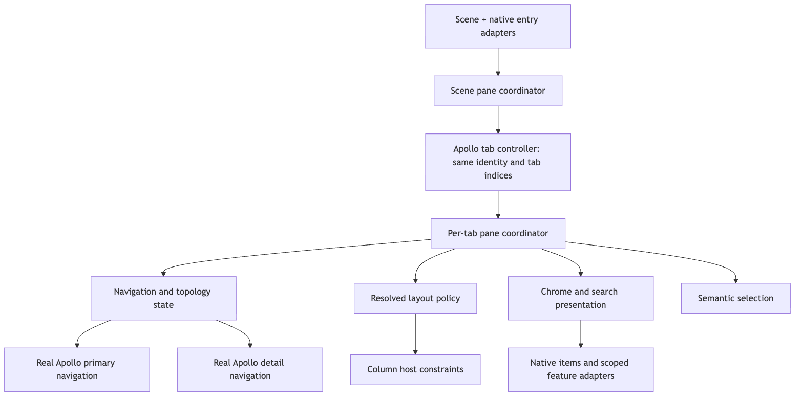

# Plan 002 — A coherent, responsive Apollo workspace for iPad

Status: implementation delivered in the working tree; release verification remains open.
Current results: [implementation and verification](003-ipad-pane-implementation-results.md).
Prepared: 7 September 2026, source baseline `fa5ddcb` on `je/ipad-pane-layout`.
Evidence: [dated source and visual audit](ipad-pane-audit-2026-09-07.md).
Starting points: [original engineering plan](../docs/ipad-pane-layout-plan.md),
[Plan 001](001-unify-ipad-pane-chrome.md), and
[PR #886 tracker](../IPAD_PANE_PR_886_IMPLEMENTATION.md).

## Recommendation

Keep Apollo's native content controllers and navigation behavior, but make the
surrounding interface a deliberate iPad workspace. Give each surface one job:
destinations choose where you are, a scannable list chooses what you are reading,
and detail gives that content room. Make search contextual and temporary. Keep
the chrome quiet and consistent. Resize without losing the user's place, and
make Back track the user's gesture.

The largest visible improvement will come from **chrome hierarchy plus list
density**, not adding another column. The largest engineering improvement will
come from **explicit ownership and transition state**, not adding more delayed
layout repairs. Smoothness is a release criterion supported by device traces.

This roadmap incorporates Plan 001, including its sidebar preference, plain-title
treatment, search integration, and artwork boundary. It supersedes that plan's
fixed 54-point requirement, narrow file allowlist, and assumption that all existing
geometry is settled. Implementation outcomes and validation gates are recorded
in the results document.

## 1. Product contract

### 1.1 The visible hierarchy

```text
Wide workspace — one destination surface, two content panes
┌────────────────┬────────────────────┬────────────────────────────────┐
│ Destinations   │ Home ⌄      ⌕  ⋯   │ Comments                 ⌕  ⋯ │
│                ├────────────────────┼────────────────────────────────┤
│ Posts          │ Title and thumbnail│ Post / media / body            │
│ Inbox    badge │ Selected post      │                                │
│ Profile        │ Title and thumbnail│ Comment conversation           │
│ Search         │ Title and thumbnail│                                │
│ Settings       │                    │                                │
└────────────────┴────────────────────┴────────────────────────────────┘

Medium workspace — UIKit destination tabs, then list and detail
┌─────────────────────────────────────────────────────────────────────┐
│                     Destination tabs                               │
├──────────────────────────┬──────────────────────────────────────────┤
│ Home ⌄             ⌕  ⋯ │ Comments                           ⌕  ⋯ │
├──────────────────────────┼──────────────────────────────────────────┤
│ Scannable post list      │ Reading content                         │
└──────────────────────────┴──────────────────────────────────────────┘

Narrow workspace — one logical browsing path
┌──────────────────────────────┐
│ Back     Current context  ⋯ │
├──────────────────────────────┤
│ List OR selected detail      │
│                              │
└──────────────────────────────┘
```

These are hierarchy sketches, not custom toolbar specifications. UIKit owns the
navigation items, bars, sidebar, and their platform presentation. Screenshots and
measured hierarchies must establish exact positions for each supported OS.

Rules:

1. One global destination mechanism is primary at a time. System transition
   crossfades may temporarily contain both representations; don't count hidden
   or noninteractive transition views as duplicate navigation.
2. Each visible content pane has one context/action row in its normal state.
   At normal text sizes, target aligned baselines and compatible heights. Derive
   actual dimensions from UIKit; 54 points is historical evidence, not a constant.
3. Passive titles are text. Interactive Home/Jump Bar titles retain a discoverable
   disclosure/control treatment. Keep native action grouping; do not wrap every
   label and icon in another glass island.
4. The primary pane is a selection surface. The detail pane is the reading or
   task surface. A long portrait image must not turn the selection surface into
   an almost single-item feed unless the user deliberately chooses that style.
5. Search names its scope: Reddit search, this feed, Settings, or this thread.
   Opening one search does not unexpectedly activate or dismiss another pane's
   search. Find-in-thread is not a second global destination.
6. Selected row and keyboard-focused row are distinguishable. Selection survives
   reloads by identity, not by painted coordinates. No auto-scroll of the list
   just because detail content appears.
7. A detail change must not resize the list or automatically toggle the sidebar.
   User sidebar intent survives tab switches and content selection.
8. Modal tasks belong to the originating scene; their presentation type decides
   whether they cover the scene or anchor to a column. Dismissal restores focus.
9. Pane-disabled and unsupported devices retain their existing behavior. Future
   adaptive-phone eligibility is a separate rollout after iPad work passes.

### 1.2 Pane contents by destination

| Destination | Primary | Detail | Empty state |
|---|---|---|---|
| Posts | Native community index/feed with pane density | Selected post; links continue here | “Select a post to read the discussion” |
| Inbox | Native mailbox/category index | Category list, conversation, or modern mailbox | “Choose a mailbox or conversation” |
| Profile | Native profile index | Selected history/list/profile subpage | Contextual instruction, not “No Post Selected” |
| Search | Search input/results in their existing navigation path | Selected result | Helpful scope guidance; no unsolicited network search |
| Settings | Native settings index | Selected settings/task screen | “Choose a setting” |

Empty detail remains spatially stable. Do not auto-select the first network item
or expand/collapse columns on every selection/clear. Use a restrained symbol,
brief instruction, and only a useful action when necessary. Loading, offline,
removed, and failed detail are different states; none should masquerade as empty
selection. Retry stays attached to the selected item and scene.

### 1.3 Width and height policy

Define `C` as the actual usable width available to the **two content panes**, after
any visible destination sidebar and system margins. Define `Pmin`, `Ppreferred`,
`Dmin`, and divider spacing `G` independently. Two panes are useful only if
`C >= Pmin + G + Dmin`. Preferred primary width must yield when detail would be
unusable. A global sidebar is preferred only if the resulting content width still
satisfies that invariant.

Initial design values to evaluate, not Apple requirements:

- Primary minimum: retain 340 points initially; typical working width 360–420;
  keep the existing 480 upper bound until density experiments justify a change.
- Detail minimum: start around 420 points for standard text, and determine a
  larger requirement for accessibility text or action-heavy screens.
- Sidebar width: use the resolved system value. Avoid hardcoding 270/280 points.
- Prose measure: use the current 680-point cap as the baseline, with the current
  accessibility relaxation as a comparison. Validate nested comments and language
  wrapping rather than assuming one measure is ideal for every screen.
- A small hysteresis band, initially 32 points, may stabilize **our preference**
  near a threshold. It must not fight UIKit's resolved mode or force unusable panes.

With a 340-point list and approximately 420-point detail, a near-square 800-point
content area could support two panes but not an additional persistent sidebar.
This is a sizing example, not a prediction of foldable hardware.

Use three adaptive presentations: sidebar + list/detail, tabs + list/detail, and
one-column navigation. Honor UIKit's temporary overlay/secondary-only modes and
always expose a public way back to the hidden list. Distinguish temporary display
state from compact navigation topology.

Height matters too. A short wide window with the keyboard open may fit two columns
but not stacked bars, a large banner, and a composer. Keep active input and its
actions visible; avoid orientation-based rules. Accessibility text may require a
larger context/search surface. Prefer a deliberate accessible layout to cramming
every control into 54 points.

## 2. Architecture to build toward




Suggested ownership boundaries; names may change if existing abstractions fit:

| Owner | Owns | Must not own |
|---|---|---|
| `ApolloPaneSceneCoordinator` | Installation status, weak pane/owner registry, destination preference, user width, originating scene, lifecycle cancellation | Content matching or cell layout |
| `ApolloPaneNavigationState` | Logical primary/detail branches, source/account generation, transaction state, pending intent and cancellation | Material colors or arbitrary view scans |
| `ApolloPaneGeometry` | Pure layout decision inputs/outputs, resolved frame sampling, owned inset contributions | Route classification or persistent state writes during measurement |
| `ApolloPaneChrome` | Title/action/search presentation, artwork boundary, idempotent state application | Recreating native navigation stacks |
| `ApolloPaneSelection` | Stable item identity, native selection and accessibility synchronization | Deciding unrelated routes |
| `ApolloPaneColumnHostViewController` | Containment and constraints around real Apollo navigation | Feed/search semantic state |
| Runtime adapters/Swift bridge | Checked access to Apollo selectors and typed private storage | Broad reinterpretation of unknown classes or UIKit internals |

Start by extracting the host, geometry, and transaction handling where ownership
is already identifiable. Preserve controller instances and existing successful
lineage checks. Do not replace the whole 4,457-line class in one unreviewable edit.

The navigation state should express stable states (expanded, compact-primary,
compact-detail) and transition ownership (navigation, topology, root return),
rather than allowing arbitrary combinations of booleans. Keep generation tokens
for stale asynchronous work, but make their owner and terminal event explicit.
A latest-selection intent may supersede another selection; lifecycle cleanup and
user Back must have defined semantics and must not accidentally coalesce as the
same kind of operation.

Every asynchronous callback must answer: which scene/pane/transaction owns me,
what invalidates me, and can I still mutate this controller? Every UIKit mutation
occurs on the main thread. An off-main helper must either assert its contract or
enqueue the **complete operation**; re-enqueuing only a boolean “should defer”
query can silently drop work when the main-thread result is NO.

No generic event bus or new dependency is needed. Keep implementation details out
of user-facing UI. New `.m/.xm` files go into `ApolloReborn_FILES`; Swift bridge
changes remain small and documented. If settings UI changes, read
`src/settings/README.md` and use its declarative form model.

## 3. Implementation work packages

Priority P1 means required for the redesigned iPad release; P2 follows before
calling it fully polished; P3 is optional product expansion. Effort is relative:
S = localized change, M = several connected paths, L = a substantial subsystem,
XL = compatibility-sensitive work with device/OS validation. These are not timing
promises. Each package gets a focused commit/review and recorded evidence.

| ID | Work | Priority / effort | Dependencies | Audit findings |
|---|---|---|---|---|
| W01 | Reproducible baseline and instrumentation | P1 / M | — | All; A17 |
| W02 | Bootstrap and scene ownership | P1 / M | W01 | A11–A12 |
| W03 | Transition liveness and navigation-state extraction | P1 / L | W01 | A05–A06, A13–A14 |
| W04 | Adaptive geometry and divider | P1 / L | W02–W03 | A03, A07–A09 |
| W05 | Unified chrome and destinations | P1 / L | W04 | A01, A16 |
| W06 | Controller-owned find and search presentation | P1 / L | W03, W05 | A01, A10 |
| W07 | Pane list density, selection, empty/detail states | P1 / L | W04–W05 | A02, A15 |
| W08 | Interactive Back and gesture arbitration | P1 / XL | W03–W04 | A04, A07, A17 |
| W09 | Reading width and async content stability | P2 / L | W04, W07 | A15 |
| W10 | Keyboard, accessibility, pointer, modal ownership | P1 / L | W02, W05–W08 | A11, A17 |
| W11 | Performance optimization and memory lifecycle | P1 / L | Baseline first; final pass after W04–W10 | A06, A09, A16–A17 |
| W12 | Release matrix and documentation reconciliation | P1 / L | W02–W11 | All |
| W13 | Optional richer sidebar and window workflows | P3 / L | W12 | Product extension |
| W14 | Adaptive-phone / foldable preparation | Separate / XL | Stable W02–W12 | Section 6 |

### W01 — Establish a trustworthy baseline

Build the current revision for simulator and device. Record commit, dirty state,
base IPA identity, baked/injected dylib UUID, runtime, device, appearance, content
style, actual view dimensions, text size, selected tab and sidebar state. Verify
that exactly one copy of the tweak is loaded. The existing cached runtime used in
the audit cannot substitute for this.

Extend simulator diagnostics with one structured pane snapshot. Include scene-local
opaque ID, pane/tab ID, logical and physical stack depths, display mode, usable
width/height, nav context/search frames, chrome owners, active transaction age,
refresh/write counts, active watchdog count, and loaded/visible controller counts.
Avoid titles, account identifiers, queries, URLs, and raw model descriptions.

Add `os_signpost` intervals for selection → detail first presentation,
navigation/topology transitions, geometry/chrome application, and divider drag.
Add counters at known measurement/refresh boundaries without installing a broad
per-scroll logger. Keep instrumentation gated and measure its overhead. Reuse
existing pane debug probes instead of making a second test language.

Use stable public read-only content for visual captures; use synthetic destinations
or a disposable account for row-swipe/gesture scenarios. Record loading and
already-loaded content separately. Save screenshots, short screen recordings,
structured snapshots, and device traces under ignored local artifact directories.

**Done:** before-state evidence for Home text/media/empty, Settings, Inbox, search,
compact and two-pane states; a real-device performance baseline or an explicitly
open hardware gate. Successful compilation is not marked as visual/performance
validation.

### W02 — Make pane bootstrap and routing scene-owned

Resolve required runtime classes/selectors and bridge layout contracts before
the scene's tab children are detached. Publish required/optional capability
results; the installer must not commit if the router could not initialize.
Retain the existing exact rollback and fault-injection tests.

Introduce per-scene installation status and weak ownership registration. Keep a
cheap aggregate active check if useful, followed by owning-pane lookup. Disconnect
invalidates pending work and removes that scene's registrations; another scene
continues unaffected. Persist only scene preferences that should survive launch,
and prune keys for discarded sessions without erasing active-session preferences.

Add an originating scene/controller path to `ApolloRouteURLThroughApp` and migrate
gallery/deleted-comment callers. Select the originating scene's real tab hierarchy
before entering native URL logic. If Apollo's AppDelegate requires a compatibility
ivar, save and restore the exact old value in `@try/@finally`; do not retain the
first scene forever. Scope native-entry getter translation to the target tab
controller rather than every tab controller reached during a global depth window.

**Done:** two scenes with different tabs/details route URLs to their origin;
failed installation in B leaves A working; cold/warm native and custom routes
still work; required-class failure leaves stock containment.

### W03 — Consolidate transition settlement and preserve state invariants

First fix waiting flags and watchdog lifetime in place. Then extract one transaction
owner. Handle accepted/rejected/late registration and duplicate completions
idempotently. Never infer “completion won't happen” solely from NO. A coordinator
identity or generation must prevent an old completion releasing a newer gate.

Replace independent unbounded polling chains with a cancellable bounded watchdog
only where callback coverage is insufficient. Check transaction liveness before
rescheduling. On disconnect, superseded token, or terminal event, release retained
closures/stacks and stop waking. On deadline, log a coarse failure and preserve the
last valid hierarchy; don't clear UIKit's internal flags or force a concurrent pop.
Derive a deadline from the native transition plus measured grace, accounting for
an interactive gesture that legitimately remains active under the user's finger.

Extract source/account generations and semantic navigation intent from chrome text.
Preserve the existing typed forward-history clear. Keep `setViewControllers` for
intentional detail-root replacement and native push/pop for branch continuation.

Add focused transition/state tests because these paths can lose user navigation:
latest selection during cancel, clear during root return, expand during compact
restore, missing completion, duplicate completion, stale source, and scene teardown.
Use a small testable state helper plus simulator integration, not tests that merely
assert private flag names or duplicate implementation code.

**Done:** one terminal resolution per transaction, no stale replay, no active
watchdog after settlement/disconnect, correct Back/forward and selection across
repeated topology cycles, and no dropped off-main operation if that API is supported.

### W04 — Make geometry deterministic and dragging cheap

Extract physical-edge resolution and the pure width policy. Correct RTL boundary,
drag sign, and keyboard meaning. Track original preferred width separately from
resolved width. Restore the original preference on cancel. Store finite clamped
values only. Native resolved geometry never silently becomes persisted intent.

Keep actual column frames as the source for host alignment. Resolve dimensions
after UIKit settles, and coalesce safe-area/size events without stranding refreshes.
Do not reintroduce constraint writes from `layoutSubviews`. Test continuous resize
as distinct from a trait-only compact override.

For live drag, update the visible pane only. If high input frequency causes more
than one costly update per frame, consume the latest sample with a display-paced
mechanism active only during drag. Stop it at end/cancel/background; don't add a
permanent display link. Apply final width to hidden panes before their next visible
frame, preserving lazy loading. Retain instant finger tracking; don't animate each
sample with a separate spring. Add Reset Column Width to the divider's accessible
actions/context menu if discoverable without extra permanent chrome.

On iOS 26+, use the public secondary minimum where it produces the intended
resolved behavior. On 18–25, choose supported show/hide/display preferences from
the same invariant. Never force size-class overrides as a production layout policy.

**Done:** no unusably narrow detail; cancelled drag restores preference; no hidden
pane reflow per drag tick; stable thresholds in both directions; correct RTL,
pointer hit region and no competing width writers.

### W05 — Give chrome one owner

Create `ApolloPaneChrome.h/.xm` and connect it to resolved pane state. Its snapshot
includes owner/controller identity, actual usable geometry, sidebar/tab state,
search state, content role, theme, text size, and reduced-transparency/motion traits.
Apply only changed state at stable lifecycle boundaries. The Liquid Glass/header
modules query this owner; they do not scan windows to rediscover it.

Carry forward Plan 001 with these refinements:

- Prefer the system sidebar on the first truly wide presentation, respect user
  collapse, and never reopen it after selecting detail. Use public callbacks
  without displacing an existing delegate. If intent cannot be distinguished,
  make the preference once per scene, not repeatedly.
- Remove custom capsule treatment for passive pane titles. Keep genuine title
  controls and their hover/focus/search behavior. Evaluate browser-style native
  navigation items only if they preserve Back, Jump Bar, and all native actions.
- Check primary feed/Settings search as well as comments find. Inactive search
  should not consume another permanent full-width row by default in the redesigned
  pane presentation. Keep a clearly discoverable search action.
- Let navigation titles identify context; counts are subordinate information.
  Do not synthesize unavailable counts or overwrite unrelated native titles.
- Bound immersive artwork below the resolved pane context/search boundary. Use
  a stable shared theme/material treatment for the bars while preserving banner
  content below them. Include profile headers in the audit, not only subreddits.
- Expanded-pane hide-on-scroll must not independently move neighboring context
  rows. Resolve a stable expanded policy and restore Apollo's compact behavior.

Separate the **context row** from UIKit's total navigation/search container in
diagnostics. At standard text sizes, aligned context baselines should differ by
no more than 0.5 point. At accessibility sizes, prioritize readable/reachable
controls and record intentional adaptation. Never change private UIKit subviews
to satisfy a numeric snapshot.

**Done:** a coherent first visual slice across Home, comments, Settings and Inbox,
with empty/populated detail; passive titles have no custom capsule; artwork and
search don't compete with navigation; every native action remains reachable.

### W06 — Fix find ownership before changing its UI

Move comments-search watchdog/node/range/generation into per-controller state.
Bind query, next, and previous to their receiving controller. Dismiss/disappear
cancels only that session. Protect synchronous multi-term/capture context with
save/restore and `@try/@finally`. Retain native match order, count, highlight,
wrap-around, and comma-term behavior. Cancel pending corrective scrolling on user
input, query change, route replacement or scene teardown; respect Reduce Motion.

For presentation, first spike the least invasive nav-row takeover of the existing
toolbar/session. Use native search integration only where the host supports it
without a second state model. A `UIFindInteraction` spike remains worthwhile for
keyboard/system behavior, but its system panel can be keyboard-docked or inline;
it does not promise to occupy the old 54-point navigation row. Arbitrary Texture
content requires a delegate/find session, not `isFindInteractionEnabled` on a
generic table. [Apple find interaction documentation](https://developer.apple.com/documentation/uikit/uifindinteraction).

Choose **one** production presentation after measuring the spike. Prefer context
row takeover at ordinary sizes if every action fits. A system keyboard find panel
is acceptable with the ordinary title row retained and the redundant Apollo
toolbar suppressed. Accessibility text may require a deliberate larger find
surface. In every case, one query/session drives one visible set of find controls,
with no unexplained content jump. Record any intentional inset change.

Do not reimplement or synthesize Apollo's private matcher simply to meet a visual
constraint. Separate global Reddit search, feed filtering, settings search and
thread find; Command-F targets the focused content that supports it.

**Done:** two independent scenes can search; switching tabs preserves appropriate
session state; next/previous after returning targets the right table; touch and
hardware keyboards, dismissal, async row changes, and user scrolling all work.

### W07 — Make the list and detail feel designed together

Prototype pane-local use of Apollo's native compact feed nodes at their creation
entry point. Trace the existing factory/configuration before choosing a hook.
Keep the user's global content-style preference intact. Existing compact thumbnail
handling in `ApolloFeedTextPostThumbnails.xm` and filtering in
`ApolloPostFilters.xm` are required compatibility checks.

Compare two purposeful densities, not arbitrary themes: a scannable compact list
as the proposed pane default, and a comfortable list that preserves media previews.
Use bounded thumbnails, enough title lines to identify a post, and subordinate
metadata. Keep media in detail appropriately sized to its aspect ratio and the
available reading area. Preserve spoiler/NSFW treatment and all native actions.

Persistent selection should be a restrained row background/accent indicator with
the selected accessibility trait. Avoid a bright border surrounding a viewport-tall
post. Focus and hover must remain distinct from committed selection. Do not change
selection semantics to obtain a prettier screenshot.

Standardize empty/loading/error detail states. Avoid automatic post selection,
background fetches just to fill whitespace, fake skeleton content, or routing
changes triggered by an empty placeholder. Expose Retry for the current failed
route where native behavior allows it.

**Done:** screenshot/interaction comparisons at 340, 400 and 480 primary widths;
short/long titles and media types remain identifiable; scrolling and selection
are stable; no global phone preference changes; load/error states preserve context.

### W08 — Restore native-feeling Back and gesture ownership

Within detail depth > 1, restore the real Apollo interactive pop behavior. The
cross-column root return must not disable that deeper branch gesture. At detail
root, implement a single progress-driven return to the primary, with native
transition timing, cancellation, and source/stack reconciliation from W03.

Before adopting a custom interactive root transition, spike whether a better
supported host/compact topology can expose native Back without the extra hidden
wrapper bar. Compare it against the existing host using the same cold-route,
restoration, first-frame, and Texture-width tests. Adopt a simpler topology only
if it removes special cases and preserves controller identity/containment.
Otherwise keep the proven host and isolate the root-return transition; don't
patch private UIKit wrappers or maintain two runtime topology fallbacks forever.

Define recognizer precedence explicitly: divider drag versus content, within-detail
Back, root Back, forward history, swipe-to-vote, and media gestures. Replace the
blanket simultaneous-recognition rule with a justified allowlist. Keep gestures
inside their actual column hit regions; mirror correctly for RTL. Avoid issuing
live-account content swipes in tests.

**Done:** slow drag follows the finger; reversing/cancelling restores exact state;
nested detail swipe Back works; a new selection during interaction settles correctly;
no duplicate nav row or disabled gesture remains after collapse/expand. Reduce
Motion uses native reduced behavior or a short dissolve without spatial travel.

### W09 — Stabilize reading width and asynchronously arriving content

Preserve the first-frame Settings inset work already shipped on this branch.
Give the readable-width owner an additive contribution rather than restoring a
stale absolute inset snapshot. Content-ready events must classify an initially
unknown comments header without waiting for rotation. Invalidate cached content
role when a controller genuinely changes content.

For media threads, spike text-row layout against a readable guide while the media
header remains wide. Do not inset the entire table and letterbox every image.
Validate nested comment indentation, long links, code blocks, inline images, and
selection/hit testing. If Apollo/Texture does not expose a safe boundary, retain
the proven full-width media-thread baseline and document the remaining limitation;
do not present that phase as complete prose-width coverage.

Preserve scroll anchor by item identity plus local offset across width changes,
then remeasure once at the new constraint where needed. Do not force reloadData,
layoutIfNeeded, or all-node invalidation on every pan sample. Framework-owned
automatic remeasurement should be measured before augmenting it.

**Done:** no full-width-to-centered snap on first visible content; stable position
after async media/text updates; correct media aspect and readable prose; no inset
ownership conflict on push/pop, modal dismissal, or compact transitions.

### W10 — Finish input, accessibility, and presentation

Track a weak focused-column intent from actual interaction/responder state, without
stealing text-field focus on selection. Reuse Apollo's native commands for list
selection, Enter, Back/forward, page navigation, Jump Bar, and media. Scope divider
shortcuts so Option-arrow still edits words inside a text field. Command-F and
Escape first resolve the focused search/modal/task, then navigation.

Verify status-bar tap and `scrollsToTop` with multiple visible scroll views; make
only the intended scroll target participate if UIKit/native behavior is ambiguous.
Restore focus to the initiating row/control when detail, search, or a modal closes.

For VoiceOver and Full Keyboard Access, give panes a useful traversal order and
labels; don't focus hidden columns. Preserve selection announcements and avoid
announcing every width tick. Test Switch Control divider adjustments, Reduce
Motion, Reduce Transparency, Increase Contrast, all accessibility text sizes, RTL,
and long localized titles. Use effective traits and canonical theme colors.

Audit popovers/action sheets, composer/login, media viewers, PiP return, custom
cards, and modern Chat/Modmail against their originating scene and control.
Bounds and `sourceRect` conversion come from that hierarchy. Don't blanket-convert
scene-wide modal tasks to column-only cards. Test indirect input for custom sheet
dismissal and media pinch/scroll, using built-in recognizers where applicable.
[Apple's iPhone Mirroring input technote](https://developer.apple.com/documentation/technotes/tn3210-optimizing-your-app-for-iphone-mirroring).

**Done:** each interaction has an explicit owner and escape path; all native
actions remain reachable with touch, keyboard, and assistive technology; two-scene
presentation tests do not open or dismiss content in the other scene.

### W11 — Optimize measured work and define memory lifetime

Use the baseline and performance protocol below throughout implementation. Prioritize
actual main-thread Texture measurement, navigation/chrome commits, image/video
decode, and render-server/material costs in that order only as traces justify.
Do not cache private UIKit subtree frames across arbitrary transitions or treat
simulator wall-clock timings as device performance.

Remove redundant passive-title effect views; make chrome updates state-diffed.
Inspect title fingerprint/refresh frequency before changing its existing cache.
Replace global navigation-item ownership scans with weak registrations. Keep the
already allocation-free tab-minimize predicate; scope policy to the resolved
visible workspace and avoid scanning all tabs for every offset change if traces
show material cost. Throttle diagnostic logging, not user input.

During live resize, don't broadcast width/layout to hidden tabs. For selected-post
changes, avoid unnecessary view loads and duplicate media work; use the existing
shareable-player lifecycle correctly. Large media in both panes can consume GPU,
memory and battery even if the geometry code is cheap. Do not silently override
the user's audio or autoplay preferences to make a benchmark pass.

Define scene-hidden/disconnected/memory-pressure handling: cancel pane-owned work,
stop active display links, discard transient snapshots/caches, and release obsolete
transaction stacks. Preserve current navigation/controllers, unsent drafts, active
media/PiP and their needed state. Only consider evicting inactive detail controllers
after demonstrating safe semantic restoration; never set arbitrary native views to
nil as a generic memory fix.

**Done:** device targets below pass, no idle pane polling remains, live resize
does not reflow hidden tabs, and retained object counts stabilize after repeated
navigation, resize and scene teardown.

### W12 — Release and reconcile the old documentation

Run the full matrix below and record actual outcomes, limitations, build IDs, and
artifact locations in the PR tracker. A focused simulator pass must not silently
close its existing device/OS gates A–G. In particular, distinguish actual window
resize from forced size-class probes and indirect-input introspection from real
pointer use.

Update the original engineering document to describe current two-content-pane
architecture, supported OS floor, root replacement policy, search implementation,
and measured behavior. Mark Plan 001 incorporated once its revised outcomes are
implemented. Keep the opt-in experimental label until the required gates pass.

**Done:** visual acceptance, functional matrix and device performance evidence are
all present. No unexplained UIKit warnings, source-ownership violations, regression
to pane-off behavior, or unsupported “buttery smooth” claims remain.

### W13 — Optional expansion after the foundation is polished

Evaluate a small sidebar section for pinned communities/multireddits using public
tab/sidebar capabilities, while retaining the real RedditList for editing and
full organization. Preserve Apollo's five stable tab indices; projecting many
`UITab` objects must not silently alter native selection/routing assumptions.
Don't add a fourth persistent content column or a second custom destination rail.

Add explicit “Open in New Window” and post-link drag/drop only once scene routing
and restoration pass. Opening a new window is a user action, not the default for
ordinary post selection. Persist minimal route identity; never serialize native
VCs, OAuth state, or content snapshots into general navigation preferences.

## 4. Motion and performance acceptance

### Motion contract

| Interaction | Intended behavior | Reduced-motion behavior |
|---|---|---|
| Choose another list item | Immediate selection and stable pane bounds; evaluate a brief detail dissolve only if it improves continuity | Immediate content replacement or short opacity change |
| Push/pop within detail | Apollo/native navigation timing; title and content settle together | Respect native reduced transition |
| Root Back gesture | Progress follows finger; reversible until commit | Preserve gesture/action, minimize spatial animation |
| Divider drag | Direct, frame-paced size changes; no separately sprung content | Same direct manipulation |
| Sidebar show/hide | UIKit transition, with one accompanying content reflow | UIKit reduced behavior |
| Search activate/dismiss | One presentation transition, stable focus and predictable inset | Immediate or short dissolve |
| Async banner/media arrival | No delayed chrome jump; preserve content anchor | Same stable geometry |

Do not select a duration as a substitute for profiling. For any new detail dissolve,
start evaluation around 120–180 ms, with no input delay and no animation queued
behind a newer selection. Never use a full-window snapshot to conceal repeated
layout corruption. A transient snapshot, if measured necessary, must have bounded
size/lifetime and cannot remain interactive or survive scene backgrounding.

### Measurement protocol

Use a physical 60 Hz iPad and a ProMotion iPad, including the oldest practical
supported hardware. Compare pane-off, current baseline pane-on, and redesigned
pane-on with matching content/cache/settings. Run at least five comparable captures
per scenario; keep cold-launch and warm-interaction data separate. Record device,
OS, refresh policy, Low Power Mode, thermal state, build and instrumentation mode.

Capture Animation Hitches/Core Animation and Time Profiler; use Allocations/VM
tracking for lifetime investigations. Attribute commit, render and content-loading
cost separately. UIKit adapts to the display, but application work can still miss
deadlines; device traces matter more than average FPS.
[Apple performance guidance](https://developer.apple.com/documentation/xcode/improving-app-responsiveness).

Required scenarios: a long text feed and thread, media-heavy feed, active comments
find, divider drag, continuous window resize across thresholds, sidebar show/hide,
rapid selection, cancelled Back, five-tab cycling, cold launch, and two-scene
open/close. Run a ten-minute resize/navigation/media soak and compare retained
objects after returning to the same idle state.

Initial **project targets**, to confirm against baseline and hardware:

| Measure | Acceptance target |
|---|---|
| Frame deadlines | Evaluate against actual refresh intervals: ~16.7 ms at 60 Hz, ~8.3 ms at 120 Hz; these are not all available to app main-thread work |
| Hitch time ratio | Target ≤5 ms/s in representative steady scrolling/resizing; report per-scenario results and worst outliers, not only averages |
| Severe stalls | Zero reproducible pane-induced UI stalls ≥100 ms in the interaction set; every smaller repeated hitch also investigated |
| Pane-specific geometry/chrome work | Initial p95 target <1 ms per applied update on the target device; report full frame cost separately |
| Interaction response | Local selection feedback by the next rendered frame; network loading reported separately from route/chrome latency |
| Idle | No continuously running pane display link/watchdog, no continuing geometry writes in unchanged state |
| Hidden panes | Zero hidden content remeasurements caused by each visible divider drag sample |
| Launch/memory | Report absolute deltas and distributions; no unexplained >5% regression against equivalent baseline runs; don't invent a universal RSS cap |
| Lifetime | No monotonic growth in pane-owned controllers, observers, transactions or snapshots across 50 repeat cycles and scene teardown |

Thresholds are acceptance goals, not measurements already achieved or Apple-wide
requirements. If content/network/native work prevents one, provide the trace and
attribution; don't declare smoothness from a successful synthetic counter probe.

## 5. Validation matrix and exit checklist

| Dimension | Required coverage |
|---|---|
| Hardware/OS | iPad mini, 11-inch, 13-inch; supported 18.x and current 26.x; 27 prerelease recorded separately; 60 Hz and ProMotion |
| Window | Portrait/landscape, halves/thirds/quadrants, short-wide, narrow-tall, threshold ±1/±16/±32 points, actual continuous resize, external display |
| Destination | All five tabs, cold restored path, deep nested detail, unknown in-place route, same-tab reselection, badges/account changes |
| Content | Empty, loading, offline/error, removed item, long text, nested comments, image, GIF/video, gallery, inline media, crosspost |
| Search/input | Each search scope; onscreen/hardware/floating keyboard; query edit, next/previous, cancel, IME composition; focus and popover dismissal |
| Transitions | Selection during push/pop/cancel, resize during search/Back, clear during topology change, tab switch with pending intent |
| Accessibility | All text categories, VoiceOver, Full Keyboard Access, Switch Control, pointer, Reduce Motion/Transparency, contrast, RTL/localization |
| Lifecycle | Two scenes, scene background/disconnect, account switch, memory pressure, restoration, launch failure/rollback |
| Controls | iPhone/pane-off, ordinary narrow iPad, custom and stock themes, Liquid Glass and compatible non-glass appearance |

Use pairwise combinations for broad coverage, then exhaustively test high-risk
intersections: compact + nested detail + cancelled Back; resize + search + keyboard;
two scenes + different searches/links/accounts; minimum width + accessibility text
and RTL. Don't claim every combinatorial state was tested from a small screenshot set.

Per work package, run the focused test plus the existing pane smoke checks. Run
`make package` for the pinned device target and the simulator inner loop when
source changes. The plan's original audit baseline predates the implementation;
see the results document for source changes and actual validation.

Release requires:

- [ ] The list/detail/destination visual hierarchy is coherent across core states.
- [ ] No duplicated search session, passive-title glass, or orphan chrome.
- [ ] Native routing, stable tab indices, selection, Back/forward and drafts survive.
- [ ] Compact nested swipe Back and interactive root cancellation work.
- [ ] Scene ownership, bootstrap rollback and lifecycle cancellation pass.
- [ ] Width constraints, RTL, cancelled drag and async readable width pass.
- [ ] Accessibility, pointer, keyboard, modal and external-display tests are recorded.
- [ ] Device hitch, memory, launch and soak results meet the agreed targets.
- [ ] Original documentation and release-gate tracker match measured reality.

If a private-API assumption cannot be verified, preserve the last safe behavior
and document that specific limitation. If a visual spike fails, choose the simpler
supported design and remove the failed implementation. Don't accumulate permanent
fallback paths or block unrelated packages merely because one optional experiment
did not succeed.

## 6. Bonus: adaptive iPhone and a future Apple foldable

### What is known

The [linked checklist](https://blakecrosley.com/blog/resizable-iphone-era-checklist)
is a useful starting prompt. Technical recommendations here are grounded in Apple
documentation and this repository, not an assumed foldable specification.

Apple's WWDC26 UIKit session explicitly describes freely resizable iPhone apps in
iPhone Mirroring and on iPad, retaining the **phone idiom**. It recommends scene
lifecycle, local view dimensions/size classes, scene geometry where needed, and
removing main-screen and orientation-based layout assumptions. Device Hub provides
a resize test environment. These are documented adaptivity requirements; they do
not establish foldable dimensions, an idiom switch, hinge APIs, or fold lifecycle.
[Modernize your UIKit app](https://developer.apple.com/videos/play/wwdc2026/278/),
[Device Hub](https://developer.apple.com/videos/play/wwdc2026/260/).

The existing tab-sidebar API also does not guarantee an iPad sidebar on a phone:
its documentation says iPhone uses the regular tab bar. Therefore a wide phone
must be able to host two content panes while retaining native destination tabs.
[Tab-sidebar mode contract](https://developer.apple.com/documentation/uikit/uitabbarcontroller/mode-swift.enum/tabsidebar).

### Feasibility

**Reusing a well-finished two-pane core is feasible and worth preparing for now.**
Shipping support for unannounced fold behavior cannot yet be promised. This is
more than removing one iPad check, but need not be a second UI rewrite if W02–W12
separate geometry, navigation state, and destination presentation properly.

| Reusable foundation | Remaining constraint |
|---|---|
| Local-width geometry and two-pane routing | Current `ApolloPaneLayoutSupported()` caches a pad-idiom-only answer, and all pane hook ctors depend on it |
| Compact/expanded logical state | Compact Back is not fully interactive today; repeated resizing must preserve deeper state, focus, search, draft and scroll anchor |
| Native controller reuse | Apollo's precompiled binary can contain phone/portrait/main-screen assumptions that changing tweak source does not remove |
| Scene ownership | Global find state and native URL routing must be fixed first |
| UIKit system destinations | Tab-sidebar mode is context/platform dependent; phone tabs must remain usable without assuming sidebar availability |
| Existing patch/build tools | Linked-SDK fields, plist capabilities and native compatibility need independent verification; an SDK-version patch is not a rebuild of Apollo |

### W14 implementation sequence

1. **Separate capability from geometry now.** Keep today's iPad-only rollout
   eligibility, but have pane decisions consume a local layout environment.
   Don't cache available width, screen, or future eligibility from first launch.
2. **Add a development-only adaptive-phone experiment after iPad stability.**
   Install the required hook infrastructure on eligible phone processes even
   when they start narrow. Activation/presentation depends on local capacity;
   a cold narrow launch must later become wide without missing ctor hooks.
3. **Keep topology installation stable.** Avoid repeatedly replacing the window
   root or rebuilding controllers on every threshold crossing. A supported
   installed container should adapt between one and two panes while preserving
   logical branches. If narrow installation cannot preserve current phone
   behavior, resolve that architecture before enabling the experiment generally.
4. **Test phone idiom at arbitrary sizes.** Use Device Hub and iPhone Mirroring;
   near-square, wide-short and rapidly alternating sizes are test inputs, not
   simulated claims about Apple's future folded/unfolded displays. Check a
   phone that stays portrait-oriented while its window becomes wide.
5. **Audit beyond `src/ipad/`.** Migrate reachable `UIScreen.mainScreen`, idiom
   and orientation geometry in headers, media, search, popovers, keyboard and
   presenters to local contexts. Check native binary paths with Hopper where a
   behavior fails; don't globally spoof the device idiom to unlock tablet UI.
6. **Verify distribution metadata separately.** Inspect the actual supplied IPA's
   scene manifest, device families, full-screen/orientation flags, launch screen,
   indirect-input declaration and linked SDK. Preserve API availability and the
   device deployment floor. `patch.sh --liquid-glass` only changes part of that
   compatibility story; don't assume it opts Apollo into every iOS 27 behavior.
7. **Add real fold-specific support only when documented.** Test continuity,
   display/safe-area changes, interruption and restoration on the actual device.
   Use any future occlusion/posture API only if Apple publishes it and the UI
   needs it. Don't reserve an imaginary hinge gutter or ship device-name checks.

Preparedness exit test: on a supported resizable phone environment, start narrow
on a thread, search and scroll, widen into list/detail, choose another item,
narrow again, cancel Back, and widen once more. The visible route, list selection,
search owner, focus and scroll anchors must remain coherent without relaunch.
Repeat with keyboard input, a draft, media playback, and a second scene where
supported. This is useful for documented resizable iPhone environments even if
the rumored foldable never ships.

### Scope judgment

Do the ownership, geometry, continuous-resize and compact-navigation work in the
iPad redesign. Defer enabling panes on ordinary iPhones and any hardware-specific
claims to W14. A responsive two-pane core is a strong investment; an exact porting
schedule would be guesswork until the adaptive-phone spike and Apple's eventual
device contract are known.
